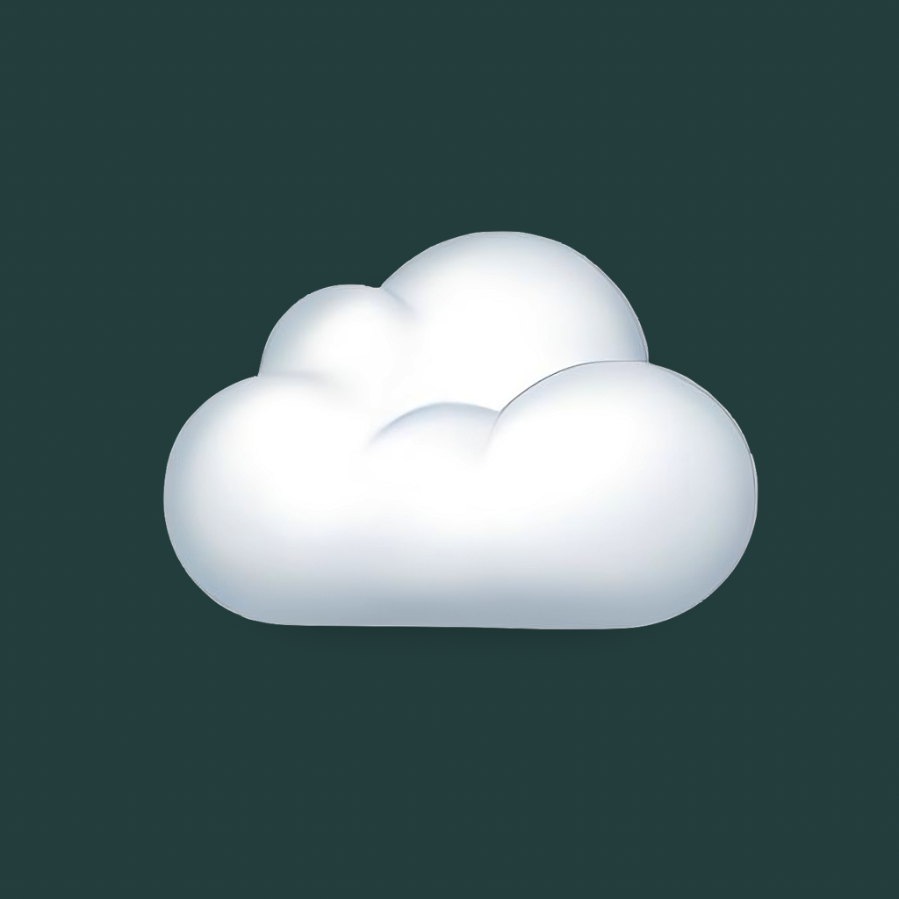
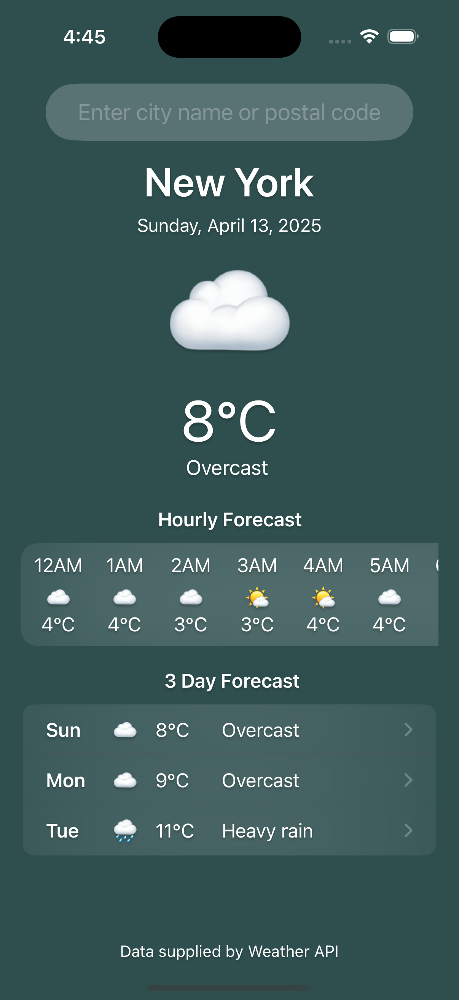
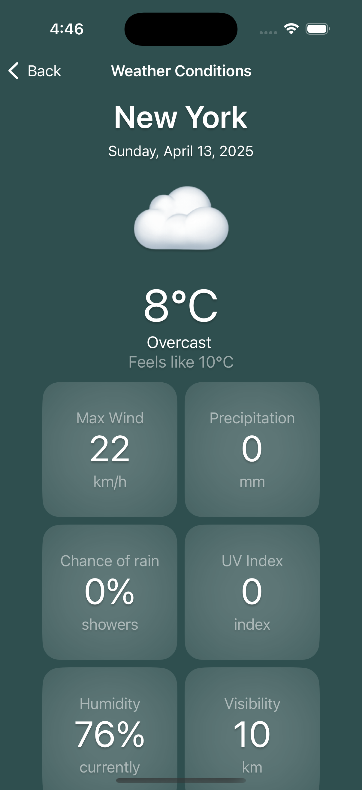

# MeteoApp 🌦️
<div align="center">
  
</div>
MeteoApp is a Swift-based weather application designed to provide accurate and real-time weather updates. With a clean user interface and robust functionality, MeteoApp ensures users always stay informed about the weather conditions in their area and around the world.

## Features

- 🌍 **Real-Time Weather Data**: Get up-to-date weather conditions.
- 📍 **Location-Based Weather**: Automatically fetch weather details for your current location.
- 🔄 **Hourly and Weekly Forecasts**: View detailed forecasts by the hour or for the week ahead.
- 🎨 **Intuitive User Interface**: Clean and modern design for a seamless user experience.
- 🚀 **Swift Performance**: Built entirely in Swift for fast and efficient performance.

---

## Demo

<div align="center">
  
  
  
</div>


---

## Installation

To run MeteoApp on your local machine:

1. Clone the repository:
   ```bash
   git clone https://github.com/ZiadNajimDev/MeteoApp.git
   ```
2. Open the project in Xcode:
   ```bash
   cd MeteoApp
   open MeteoApp.xcodeproj
   ```
3. Install dependencies (if applicable) :  [Alamofire](https://github.com/Alamofire/Alamofire.git)
4. Build and run the app on a simulator or a connected device.

---

## Technologies Used

- **Swift**: Primary programming language.
- **Alamofire**: Used for seamless network requests and API integration. Alamofire GitHub Repository
- **SwiftUI**: For building the user interface.
- **Core Location**: For location-based weather fetching.
- **API Integration**: [WeatherApi](https://www.weatherapi.com/).

---


## License

This project is licensed under the [MIT License](LICENSE).


📧 Contact: [najimziad3@gmail.com](mailto:najimziad3@gmail.com)  


